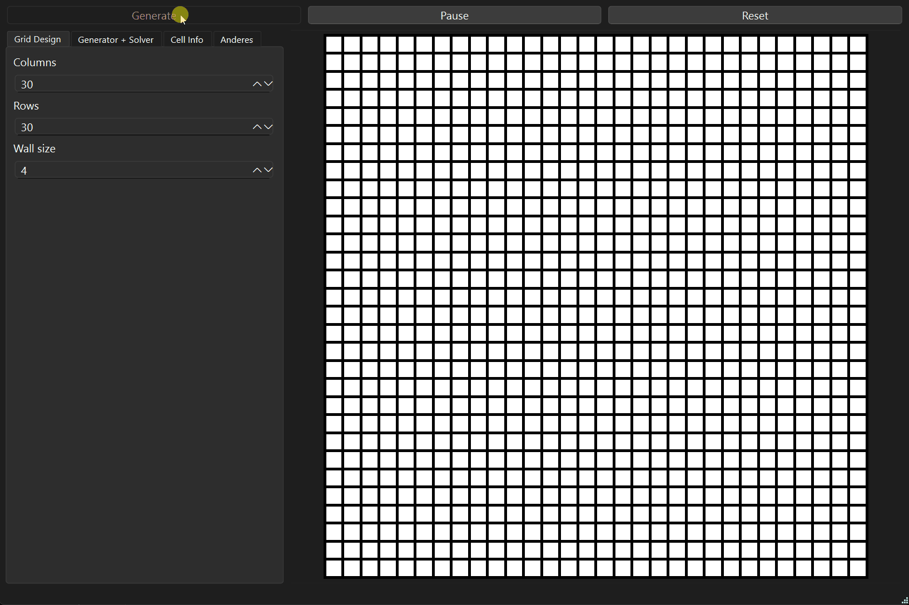

# MazeQT

**MazeQT** ist eine interaktive Desktop-Anwendung zur Erstellung und Visualisierung von Labyrinthen, entwickelt in **C++** mit **Qt**.

Dieses Projekt ist die Weiterentwicklung des ursprünglichen SFML-Projekts [Maze_Generator_Solver](https://github.com/Nils-Scharein/Maze_Generator_Solver) und wurde mit einem modernen GUI-Ansatz neu aufgebaut.

## Vorschau

Hier ein animierter Einblick in die Funktionsweise der Anwendung:

 <!-- Ersetze ggf. den Pfad zum GIF -->

## Highlights

- Intuitive Benutzeroberfläche mit Qt
- Live-Visualisierung von Maze-Generierungsalgorithmen
- Modulare C++-Architektur
- Leicht erweiterbar für eigene Ideen und Erweiterungen

## Technologien

- **C++17**
- **Qt**
- **CMake**
